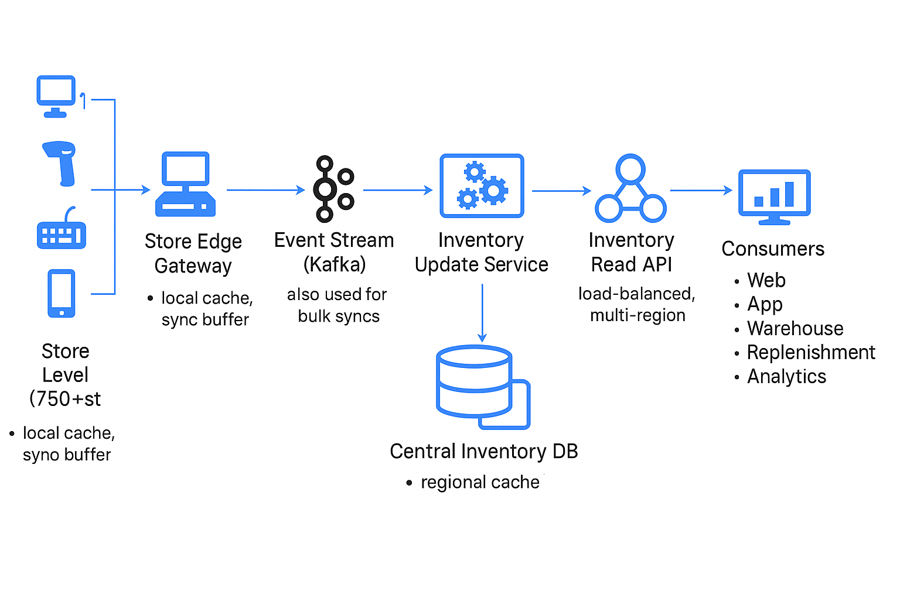

# 🏬 Real-Time Inventory Management System (750+ Stores)

This architecture outlines a scalable, low-latency inventory tracking system deployed across 750+ retail locations.
It supports real-time updates, reliable sync, resilient edge operations, and efficient caching strategies.

---

## 📌 Architecture Overview

---

## 🧩 Key Components

### 1. 🏬 **Store Edge Gateway**
- Connects POS systems, scanners, handhelds
- Handles:
  - Local cache
  - Sync buffer in case of network outages
- Optimized for resilience at the edge

### 2. 🔁 **Event Stream (Kafka)**
- Publishes all inventory changes via topics like `inventory-events`
- Partitioned by `storeId` or `skuId`
- Used for:
  - Real-time updates
  - Bulk sync and replay
  - Decoupling producers and consumers

### 3. ⚙️ **Inventory Update Service**
- Stateless processor subscribed to Kafka
- Performs:
  - Validation
  - Aggregation
  - Write to DB and cache
- Dead-letter queue for failed events

### 4. 🧠 **Central Inventory Database**
- Stores `{storeId, skuId} → quantity`
- Backed by:
  - Scalable NoSQL (e.g., Cassandra, DynamoDB)
  - Or sharded RDBMS (e.g., PostgreSQL, Oracle)
- Supports regional read replicas

### 5. ⚡ **Caching Layer**
- Multi-region Redis/Memcached for fast read access
- Caching strategy:
  - Write-through or lazy loading
  - TTL-based eviction
- API hits cache first, falls back to DB

### 6. 🌐 **Inventory Read API**
- Stateless, load-balanced service
- Serves:
  - Web & mobile clients
  - Store devices
  - Warehouse and ERP systems
- Multi-region deployment for low-latency reads

### 7. 📊 **Downstream Consumers**
- Web & Mobile Apps
- Warehouse Replenishment
- Reconciliation Jobs
- Analytics and Reporting Pipelines

---

## 🛡️ Resilience Strategies

| Layer | Strategy |
|-------|----------|
| Store edge | Local write buffer and retry |
| Event stream | Replayable Kafka with long retention |
| Cache | TTLs and DB fallback |
| API | Multi-region redundancy and load balancing |

---

## 🛠️ Technologies (Example Stack)

| Layer | Tools |
|-------|-------|
| Messaging | Kafka, ActiveMQ |
| Edge Cache | RocksDB / Redis |
| DB | Cassandra / PostgreSQL / Oracle |
| API | Vert.x / Dropwizard / Spring Boot |
| Monitoring | Prometheus + Grafana |
| CI/CD | Jenkins, Spinnaker |

---

## 📂 Files
- `diagrams/inventory-architecture.drawio` – Editable architecture
- `diagrams/inventory-architecture.png` – Image for inline rendering
- `docs/inventory-design.md` – This page in markdown

---
